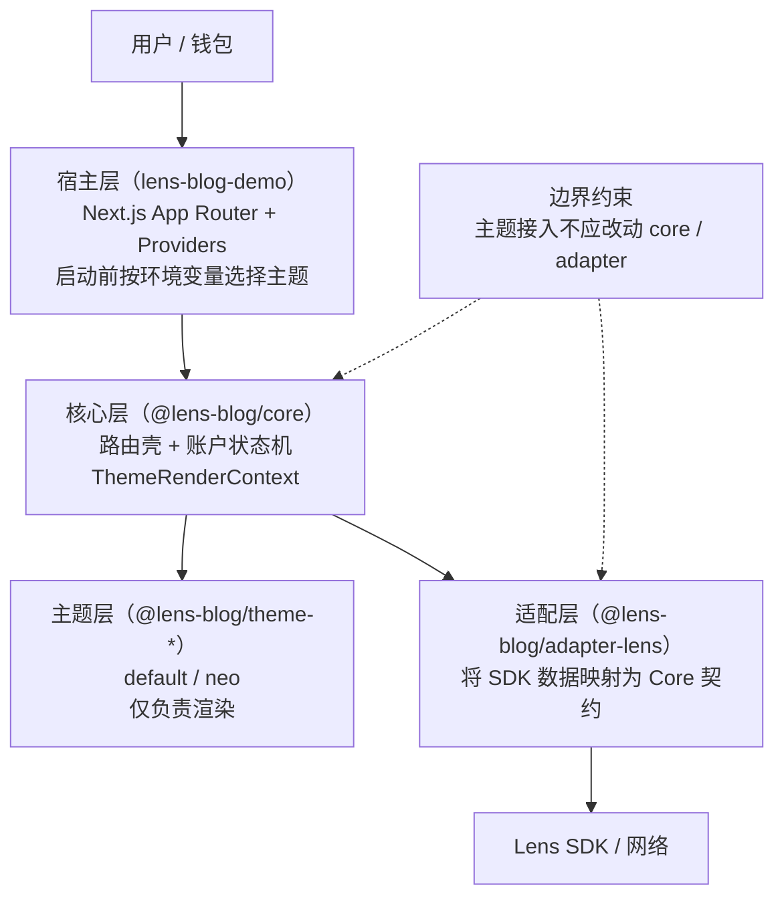

# lens-skills (WIP)

本仓库用于维护 Codex Skills，并提供一个可运行的 Lens Blog Demo 作为实现参考。
当前设计是双轨：`skills` 负责方法和约束，`demo` 负责代码落地与验证。

## 架构总览

```txt
lens-skills/
├── AGENTS.md
├── skills/                       # 方法层（如何做）
│   ├── demo-project-starter/
│   ├── lens-blog/
│   └── blog-frontend-governor/
├── packages/                     # 实现层（做成什么）
│   ├── lens-blog-core/
│   ├── lens-blog-adapter-lens/
│   ├── lens-blog-theme-default/
│   └── lens-blog-theme-neo/
└── lens-blog-demo/               # 宿主应用（Next.js）
```

## Part A: Skills 架构

### 目标

- 让 agent 在多次任务中稳定复用同一套构建方法
- 将“业务接入”“前端 contract”“主题使用”分离

### 职责划分

1. `demo-project-starter`
- 搭可运行 demo 骨架（脚手架和最小验收）

2. `lens-blog`
- 接入 Lens 业务主流程（连接钱包、账户登录、发布、拉取）
- 提供 Lens 运行时配置策略与 SDK 版本约束

3. `blog-frontend-governor`
- 约束前端 contract（路由、状态机、权限、UI 结构）
- 约束 package 分层（core/adapter/theme）与实现边界

### 关于 Theme 的规则（当前阶段）

- 终端用户不需要开发 theme
- App 构建任务只负责“选择并接入已存在的 theme 包”
- Theme 在启动前通过配置选择，不做页面运行时切换
- Theme 开发属于独立 skill（`theme-develop`，后续补齐）

## Part B: Demo 实现架构

`lens-blog-demo` 采用分层实现：

1. Host 层（Next.js）
- `app/` 负责入口与 providers
- 读取环境变量并固定本次运行主题

2. Core 层（`@lens-blog/core`）
- 账户状态机与路由壳
- 主题上下文 `ThemeRenderContext`

3. Adapter 层（`@lens-blog/adapter-lens`）
- Lens SDK 到前端契约的映射
- UI 不直接调用 Lens SDK

4. Theme 层（`@lens-blog/theme-*`）
- 纯渲染实现，可替换
- 当前内置 `default`、`neo`



### 不变更边界（高优先）

- 仅做视觉美化时：只改 `@lens-blog/theme-*`
- 仅接入已有主题时：只改宿主配置与主题包依赖
- 不因主题需求修改 `core/adapter`

## 快速开始（运行 demo）

```bash
cd ./lens-blog-demo
cp .env.example .env.local
npm install
npm run dev
```

## 环境变量（`lens-blog-demo/.env.local`）

```env
NEXT_PUBLIC_LENS_NETWORK=testnet
NEXT_PUBLIC_WALLETCONNECT_PROJECT_ID=your_walletconnect_project_id
NEXT_PUBLIC_BLOG_THEME=default
# NEXT_PUBLIC_LENS_APP_ADDRESS=0xYourCustomOrGlobalAppAddress
```

- `NEXT_PUBLIC_LENS_NETWORK`: 可选，`testnet` 或 `mainnet`
- `NEXT_PUBLIC_WALLETCONNECT_PROJECT_ID`: 当前阶段必填
- `NEXT_PUBLIC_BLOG_THEME`: 可选，`default` 或 `neo`（启动前配置）
- `NEXT_PUBLIC_LENS_APP_ADDRESS`: 可选，覆盖默认 App 地址

## 技能触发示例

- `请用 $demo-project-starter 创建一个可运行 demo`
- `请用 $lens-blog 接入 Lens 登录和发布`
- `请用 $blog-frontend-governor 按 contract 收敛前端架构`

## 发布前检查

1. `cd lens-blog-demo && npm run build`
2. `git status`
